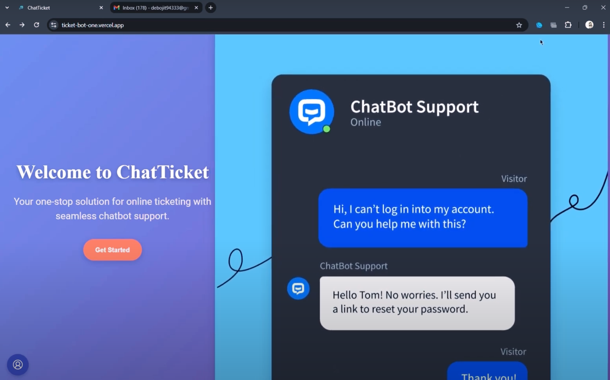
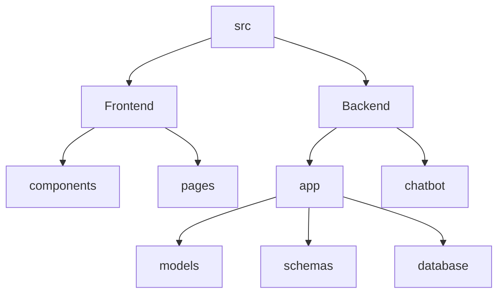

# ChatTicket - A Full-Stack Ticketing System

## 🗂️ Description

ChatTicket is a comprehensive ticketing system that enables users to book tickets for various events and exhibitions. The system consists of a user-friendly frontend built with React and a robust backend powered by FastAPI. It provides features like user authentication, ticket booking, chatbot integration, and analytics.

The project aims to provide a seamless experience for users to discover, book, and manage their tickets, while also offering administrators valuable insights into ticket sales and user activity.

## ✨ Key Features

### **User Features**
* User registration and login functionality
* Browse and book tickets for various events
* View and manage bookings
* Chatbot integration for assistance

### **Admin Features**
* Dashboard for analytics and insights
* Manage users, events, and ticket inventory
* Monitor earnings and ticket sales

### **Technical Features**
* FastAPI backend with MongoDB database
* React frontend with Tailwind CSS styling
* Integration with Dialogflow for chatbot functionality

## 🗂️ Folder Structure

## 🛠️ Tech Stack

## ⚙️ Setup Instructions

* Git clone the repository: `https://github.com/night-spring/ChatTicket.git`
* Install dependencies:
  * Frontend: `npm install` or `yarn install`
  * Backend: `pip install -r requirements.txt`
* Run the application:
  * Frontend: `npm start` or `yarn start`
  * Backend: `uvicorn main:app --host 0.0.0.0 --port 8000`

## 🤖 Chatbot Integration

The chatbot is built using Dialogflow and integrated with the React frontend. It provides users with assistance and support throughout the ticket booking process.

## 📊 Analytics and Insights

The admin dashboard provides valuable insights into ticket sales, user activity, and earnings. It uses data visualization libraries like Recharts to display the data in a clear and concise manner.

## 🚀 Deployment

The application can be deployed on various platforms like Vercel, Heroku, or AWS. The `vercel.json` file provides configuration settings for deployment on Vercel.

## GitHub Actions

The repository uses GitHub Actions for continuous integration and deployment. The workflow file `.github/workflows/main.yml` defines the build and deployment process.

  

<h3>Debojit Roy</h3>

Focused on backend development and machine learning.

 

  <a href="https://gitfull.vercel.app">Made by GitFull</a>

    
